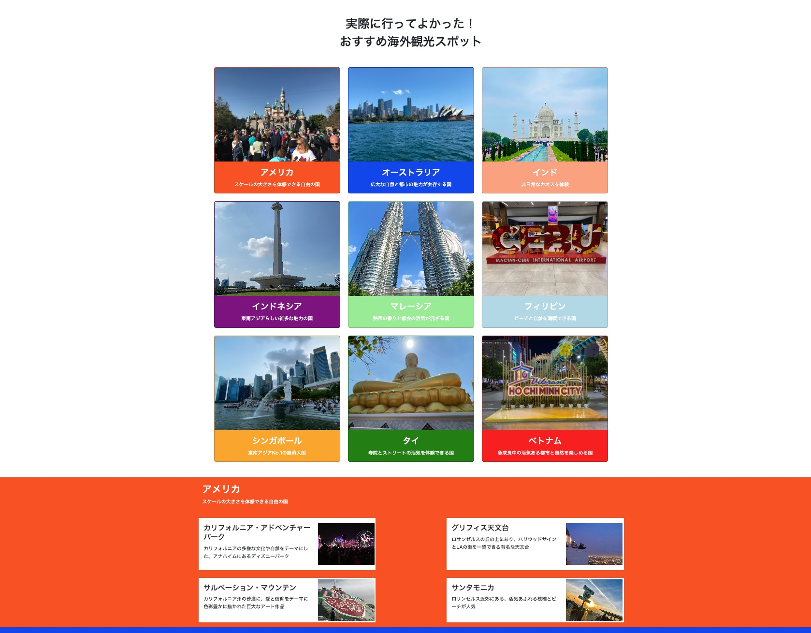

## 01_travel_spot

このリポジトリは、「DOM操作」「連想配列（オブジェクト）」「クラス」といった基本的なJavaScriptの概念を実践的に学ぶためのポートフォリオプロジェクトです。  
旅行の観光地情報を動的に表示するWebページを実装することで、これらの技術の理解を深めることを目的としています。


## 概要
このプロジェクトは、複数の国とそれぞれの観光スポット情報を表示します。
ユーザーが国を選択すると、その国の観光スポットが詳細とともに表示される仕組みになっています。


## 目的

このプロジェクトは、以下の技術を実際に使ってみることを主な目的としています。

- DOM操作  
HTML要素をJavaScriptで動的に生成、追加、変更する
- 連想配列（オブジェクト）  
観光地のデータ（説明文、画像パス）をキーと値のペアで管理する
- クラス（Class）  
Country や Spot のようなオブジェクトを作成し、再利用可能なコードを記述する

## 完成イメージ




## 技術スタック

- HTML
- CSS (Bootstrap 5.3.7)
- JavaScript


## ディレクトリ構成

```
01_travel_spot
├── css/
│   └── style.css
├── js/
│   ├── main.js
│   ├── constants.js
│   ├── Country.js
│   └── Spot.js
├── images/
│   ├── america
│   ├── australia
│   ├── india
│   ├── malaysia
│   ├── phillipines
│   ├── screenshots
│   ├── singapore
│   ├── thailand
│   └── vietnam
├── index.html
└── README.md
```


## 主な機能

- 動的なコンテンツ生成  
JavaScriptでCountryやSpotクラスのインスタンスを作成し、HTMLコンテンツを動的に生成します
- データ管理  
constants.jsファイルに連想配列として観光地の情報（説明文、画像パス）をまとめて管理することで、データの変更や追加を容易にしています
- コンポーネント化  
CountryクラスやSpotクラスを使うことで、それぞれの情報を独立したパーツとして扱い、コードの再利用性を高めています


## セットアップ
1. このリポジトリをクローン
2. `index.html` をブラウザで開くだけでOK


## 動作確認
- Google Chrome 最新版
- Firefox 最新版


## Qiitaリンク
『【ポートフォリオ 04】JavaScriptで海外旅行スポットサイト風ページを作成 ~DOM操作とクラス設計を実践~』
[記事を読む](https://qiita.com/mabo23/items/f82ec0bb46c128b7e64a)